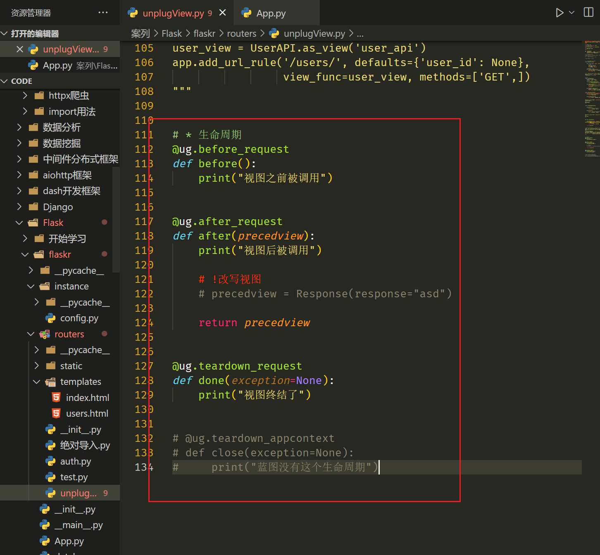

# Flask框架

flask，精悍简洁、可扩展强，第三方组件多。

官网：https://dormousehole.readthedocs.io/en/latest/

webFramework选择顺序：

1.fast-api：首选fast-api框架，搭建web后端服务。天生异步MVC框架。

2.Flask：同步MVC框架，轻量级别。

3.django：同步MVT框架，重武器，有你想要的一切。

4.Toronto：异步MVT框架，老牌异步web框架，其中的ioloop内核，经常被拿来单独使用。

## 目录结构

```
# 安装
pip install flask
```

```
基本目录，自定义
App.py- 主文件，配置各种全局参数
      |
    ---static 静态文件css js files等
	---templates 模板文件 html
	---routers 子路由
	---modles 数据模型
	---XXX 其他文件夹，有需要可以自定义
```

### 常用依赖

- [Werkzeug](https://palletsprojects.com/p/werkzeug/) 用于实现 WSGI ，应用和服务之间的标准 Python 接口。
- [Jinja](https://palletsprojects.com/p/jinja/) 用于渲染页面的模板语言。
- [MarkupSafe](https://palletsprojects.com/p/markupsafe/) 与 Jinja 共用，在渲染页面时用于避免不可信的输入，防止注入攻击。
- [ItsDangerous](https://palletsprojects.com/p/itsdangerous/) 保证数据完整性的安全标志数据，用于保护 Flask 的 session cookie.
- [Click](https://palletsprojects.com/p/click/) 是一个命令行应用的框架。用于提供 `flask` 命令，并允许添加自定义 管理命令。
- [Blinker](https://pythonhosted.org/blinker/)异步信号库，帮助实现功能解耦
- [Watchdog](https://pythonhosted.org/watchdog/) 为开发服务器提供快速高效的重载。
- [greenlet](https://greenlet.readthedocs.io/en/latest/)异步网关

## 快速上手

### 基础路由

装饰器@app.route("/")


#### 路由传参

<name>

路由传参：**get传参不一样哦**


### 内部路由跳转

url_for跳转模板


#### 重定向与异常响应

只有两种异常，蓝图子路由组件无法简单捕获。404，405

真正的重定向方法，通常与url_for结合使用


### 请求头request


### SSR静态文件代理


### 响应头response

####  基础响应


#### json特定响应

直接字典即可


#### 高级响应

自定义范围更大。


### cookie设置


### session设置

cookie唯一区别，加密和不加密的区别。

#### 原生加密方法：


#### 三方加密方式：

MD5加密

全称：MD5消息摘要算法（英语：MD5 Message-Digest Algorithm），一种被广泛使用的密码散列函数，可以产生出一个128位（16字节）的散列值（hash value），用于确保信息传输完整一致。md5加密算法是不可逆的，所以解密一般都是通过暴力穷举方法，通过网站的接口实现解密。

SHA1加密

全称： 安全哈希算法（Secure Hash Algorithm）主要适用于数字签名标准（Digital Signature Standard DSS）里面定义的数字签名算法（Digital Signature Algorithm DSA），SHA1比MD5的安全性更强。对于长度小于2^ 64位的消息，SHA1会产生一个160位的消息摘要。

HMAC加密

全称： 散列消息鉴别码 （Hash Message Authentication Code）， HMAC加密算法是一种安全的基于加密hash函数和共享密钥的消息认证协议。实现原理是用公开函数和密钥产生一个固定长度的值作为认证标识，用这个标识鉴别消息的完整性。使用一个密钥生成一个固定大小的小数据块，即 MAC，并将其加入到消息中，然后传输。接收方利用与发送方共享的密钥进行鉴别认证等。

DES加密：

全称：数据加密标准（ Data Encryption Standard ），属于对称加密算法。 DES是一个分组加密算法，典型的DES以64位为分组对数据加密，加密和解密用的是同一个算法。它的密钥长度是56位（因为每个第8 位都用作奇偶校验），密钥可以是任意的56位的数，而且可以任意时候改变。

AES加密：

全称：高级加密标准（英语：Advanced Encryption Standard），在密码学中又称Rijndael加密法，是美国联邦政府采用的一种区块加密标准。这个标准用来替代原先的DES，已经被多方分析且广为全世界所使用。

RSA加密:

全称： Rivest-Shamir-Adleman， RSA加密算法是一种非对称加密算法。在公开密钥加密和电子商业中RSA被广泛使用。它被普遍认为是目前最优秀的公钥方案之一。RSA是第一个能同时用于加密和数字签名的算法，它能够抵抗到目前为止已知的所有密码攻击。

ECC加密：

全称：椭圆曲线加密（Elliptic Curve Cryptography），ECC加密算法是一种公钥加密技术，以椭圆曲线理论为基础。利用有限域上椭圆曲线的点构成的Abel群离散对数难解性，实现加密、解密和数字签名。将椭圆曲线中的加法运算与离散对数中的模乘运算相对应，就可以建立基于椭圆曲线的对应密码体制。

UUID：

生成唯一ID。标识唯一性，通常和时间戳有关。

### 文件上下传

基于表单上传文件。


基于a标签（链接方法）下载文件。


### 日志配置


#### 高级日志配置

https://dormousehole.readthedocs.io/en/latest/logging.html


#### 配置文件，一般都是单独配置

设置日志文件存放位置。


#### 发送服务器邮件


#### 其他不常用


### 常用响应内容的类型

https://www.runoob.com/http/http-content-type.html


代理静态文件，巨坑。


## 同步网关

已自动安装。


## 蓝图（多路由）

https://dormousehole.readthedocs.io/en/latest/blueprints.html

其他配置选项。


这里我们将使用蓝图构建更大型的项目。

## 全局配置选项Api

https://dormousehole.readthedocs.io/en/latest/config.html

太多了。

### 配置数据库链接

主要看这版学习

https://docs.sqlalchemy.org/en/14/tutorial/index.html

flask在数据库链接中，文档已经常年不更新了。注意啊。

```
# 不推荐使用，必须手动载入app对象，真的巨坑。只适合临时用用。
pip install -U Flask-SQLAlchemy
# 推荐使用
pip install -U SQLAlchemy
```

使用原生SQLAlchemy。ORM抽象class进行增删改查。

**我们不选择使用它。古老的方法**

CORE直接原生sql执行增删改查。既然我们懂sql那就直接用，不好嘛。

简单查询（简单sql），推荐API。

复杂查询（分组，子查询，跨表，窗口等），这里还是推荐sql


#### TEXT用法


#### ORM用法


### 构建子组件

嵌套路由，子路由等等。

https://dormousehole.readthedocs.io/en/latest/blueprints.html


## 表单验证

https://dormousehole.readthedocs.io/en/latest/patterns/wtforms.html

属于Flask方案之一 。由于都是json数据流，我们不做from-data考虑

## Flask方案

https://dormousehole.readthedocs.io/en/latest/patterns/index.html

使用虚拟化容器方案，解决多应用冲突

推荐docker and conda

视图缓存。

https://flask-caching.readthedocs.io/en/latest/

```
pip install Flask-Caching
```

惰性视图。看看就行。

https://dormousehole.readthedocs.io/en/latest/patterns/lazyloading.html

## 异步任务

基于celery，非插件，而是文件的方式。

https://dormousehole.readthedocs.io/en/latest/patterns/celery.html

## 单页应用SPA

接收到404请求时，依然渲染index.html主页。


## rest接口模式


## 高级错误

https://dormousehole.readthedocs.io/en/latest/errorhandling.html

### 1.错误日志工具（收费）

```
pip install sentry-sdk[flask]
```

大型项目时，再去使用。


### 2.注册错误视图

解决SPA路由404问题，就在这里。重新渲染index.html即可


### 3.通用异常处理器


### 4.返回API异常处理


## CORS跨域

https://flask-cors.readthedocs.io/en/latest/

```
pip install -U flask-cors
```


### 详细设置

最方便的配置:

https://flask-cors.corydolphin.com/en/latest/api.html

```
默认值：
CORS_ALLOW_HEADERS: “*”
CORS_ALWAYS_SEND: True
CORS_AUTOMATIC_OPTIONS: True
CORS_EXPOSE_HEADERS: None
CORS_INTERCEPT_EXCEPTIONS: True
CORS_MAX_AGE: None
CORS_METHODS: [”GET”, “HEAD”, “POST”, “OPTIONS”, “PUT”, “PATCH”, “DELETE”]
CORS_ORIGINS: “*”
CORS_RESOURCES: r”/*”
CORS_SEND_WILDCARD: False
CORS_SUPPORTS_CREDENTIALS: False
CORS_VARY_HEADER: True
```


## jinja2模板

这里我们忽略模板，因为前后端分离的必要性。

本人会vue，react.

https://dormousehole.readthedocs.io/en/latest/templating.html

```
pip i jinja2
```

## 内部解耦信号

https://dormousehole.readthedocs.io/en/latest/signals.html

```
# 推荐使用三方信号库
pip install blinker
```

主要是是传递消息，让一部分业务解耦。

官方推荐这个库，使用方便。


## 高级视图

https://dormousehole.readthedocs.io/en/latest/views.html

### 抽象视图


### 视图继承


### REST抽象方法


### 视图拦截


## 异步视图

这里就很讲究了。还是推荐fastApi

https://dormousehole.readthedocs.io/en/latest/async-await.html

```
pip i greenlet
```

## 部署方式

一般静态文件交给nginx代理，server的动态路由走反向代理。

https://dormousehole.readthedocs.io/en/latest/deploying/index.html

## 命令行接口

了解基础命令即可。

https://dormousehole.readthedocs.io/en/latest/cli.html

部署完毕，需要nginx代理静态文件，然后启动flask run

```
flask run -h 127.0.0.1
-h, --host TEXT                 The interface to bind to.
-p, --port INTEGER              The port to bind to.
```


## 生民周期（不常用）

https://dormousehole.readthedocs.io/en/latest/appcontext.html

https://dormousehole.readthedocs.io/en/latest/reqcontext.html




## RESTAPI

直接全部接口化的插件包。

https://flask-restplus.readthedocs.io/en/stable/

```
pip install flask-restplus
```


## 常用扩展

### 用户权限

- [Flask-login](https://github.com/maxcountryman/flask-login)
### 开发调试

- [Flask-Script](http://www.jiege.tech/extensions/flask-script.html)
- [Flask-DebugToolbar](http://www.jiege.tech/extensions/flask-debugtoolbar.html)

### 数据模型

- [Flask-SQLAlchemy](http://www.jiege.tech/extensions/flask-sqlalchemy.html)
- [Flask-Migrate](http://www.jiege.tech/extensions/flask-migrate.html)
- [Flask-GraphQL](https://pypi.org/project/Flask-GraphQL/)

### 数据缓存

- [Flask-Cache](http://www.jiege.tech/extensions/flask-cache.html)

### `Session`

- [Flask-Session](http://www.jiege.tech/extensions/flask-session.html)

### 前后端分离的项目

- [Flask-RESTPlus](http://www.jiege.tech/extensions/flask-restplus.html)
- [Flask-JWT-Extended](http://www.jiege.tech/extensions/flask-jwt-extended.html)
- [Flask-HTTPAuth](http://www.jiege.tech/extensions/flask-httpauth.html)
- [Flask-RESTful](http://www.jiege.tech/extensions/flask-restful.html)

### 邮件发送

- [Flask-Mail](http://www.jiege.tech/extensions/flask-mail.html)

### 异步操作

- [Flask-Celery-Helper](http://www.jiege.tech/extensions/flask-celery-helper.html)

### 跨域解决

- [Flask-CORS](http://www.jiege.tech/extensions/flask-cors.html)

### 模板相关

- [Flask-Bootstrap](http://www.jiege.tech/extensions/flask-bootstrap.html)
- [Flask-Moment](http://www.jiege.tech/extensions/flask-moment.html)
- [Flask-WTF](http://www.jiege.tech/extensions/flask-wtf.html)
- [Flask-Uploads](http://www.jiege.tech/extensions/flask-uploads.html)

